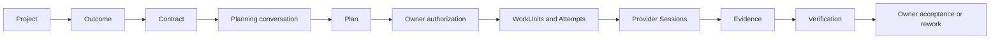

# Waldo Kennel

<p align="center">
  
</p>

**The user manages Outcomes. Kennel manages the execution required to make them true.**

Kennel is a local-first desktop app for supervising coding agents. Describe what
you want, review a plan, authorize work, and follow its progress in Mission
Control. Open a provider Session for detail; review the evidence before deciding
whether the Outcome is complete.

Waldo helps understand and plan. Kennel's Go daemon validates authority,
schedules work and records what happened. Provider runtimes execute the work.

**Active beta, not yet a published release.** The implementation supports serial
WorkUnit execution, but the complete packaged Outcome journey through artifact,
verification and owner acceptance is still a launch gate. See
[current status](docs/STATUS.md) for tested behavior and known gaps.

## Try from source

Install the [development toolchain](docs/development.md#toolchain): Node.js
22.23.2, npm 10.9.8, Go as pinned in `backend/go.mod`, Git, and tmux on
macOS/Linux. Provider CLIs need their own installation and authentication.

```sh
git clone --branch beta https://github.com/waldoco/Waldo-Kennel.git
cd Waldo-Kennel
npm run bootstrap
npm --prefix frontend run dev
```

In Settings, configure an owner-supplied OpenAI/Anthropic API credential or an
authenticated native Codex reasoning path. Register a local Project, describe an
Outcome, then review its Contract and Plan before authorizing execution.
Missing or unsupported configuration is shown explicitly; there is no hidden
provider fallback. App state lives under `~/.kennel` by default.

Source development is the current entry point. Published installation artifacts
and the update path still need release verification.

## How it fits together



An Outcome is a responsibility with a definition of done. A WorkUnit is a
bounded piece of execution. Split responsibility into contributing Outcomes;
split execution into WorkUnits with dependencies. The current scheduler runs
serially; parallel scheduling requires the workspace and recovery guarantees
in [ADR 0009](docs/adr/0009-workunit-scheduling-workspace-leases-and-effect-fencing.md).
A successful provider session or green check does not accept an Outcome.

The desktop uses Electron/React. The loopback Go daemon owns canonical state in
SQLite and exposes generated APIs to the desktop and thin CLI. See the
[architecture](docs/architecture.md), [documentation map](docs/README.md), and
[brand asset manifest](docs/assets/brand/README.md).

Codex, Claude Code, OpenCode, Cursor and Pi are the five current execution
provider identities. Available roles and capabilities depend on the installed,
authenticated runtime; identity alone does not establish conformance. Reasoning
configuration and execution-provider readiness are separate boundaries.

## Contribute

Start with [CONTRIBUTING.md](CONTRIBUTING.md), pick a focused
[issue](https://github.com/waldoco/Waldo-Kennel/issues), and check the
[milestones](https://github.com/waldoco/Waldo-Kennel/milestones).
Branches and implementation PRs start from and target `beta`; maintainers
promote tested integration through a separate `beta` → `main` PR.

[AGENTS.md](AGENTS.md) owns the engineering rules and current authority order.
[STATUS.md](docs/STATUS.md) records implementation and verification;
[ROADMAP.md](ROADMAP.md) describes future direction and exit gates, including
Project understanding, Memory, parallel orchestration and learning.

## License and provenance

Apache-2.0. Kennel is independently maintained and derived from AO.
See [LICENSE](LICENSE), [NOTICE](NOTICE), and
[upstream provenance](docs/upstream-provenance.md).
