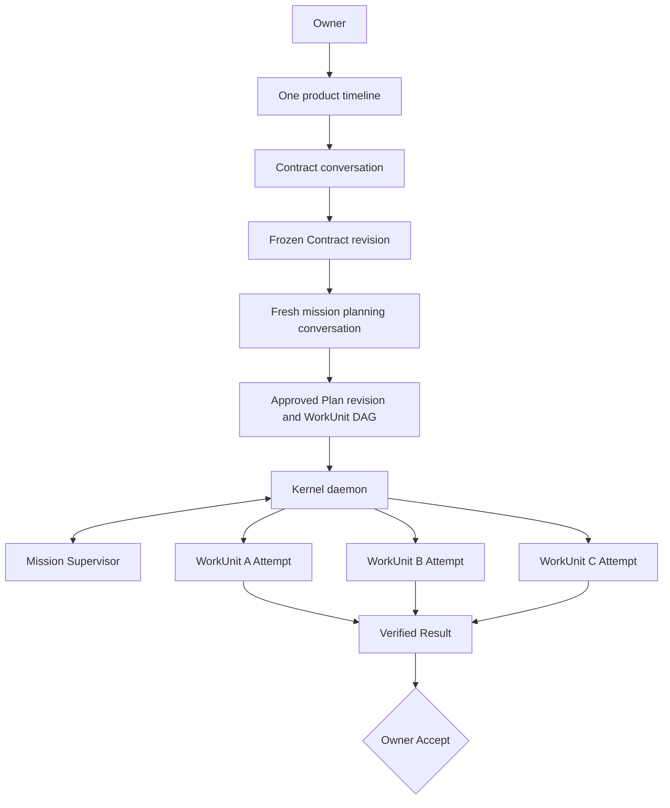
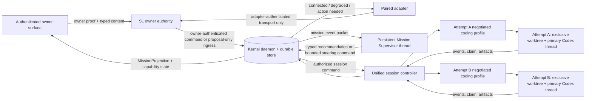
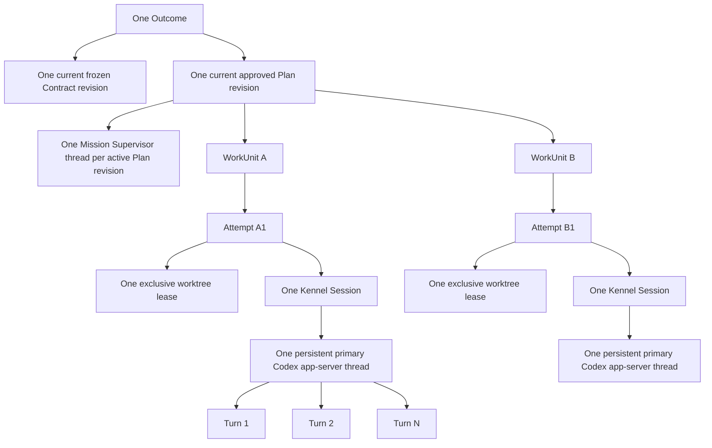
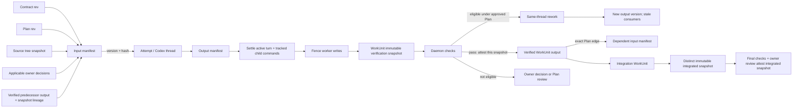
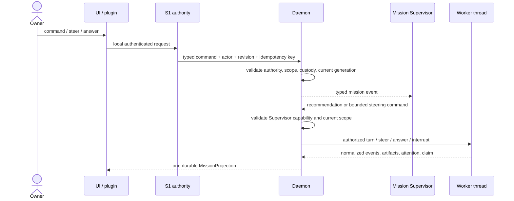
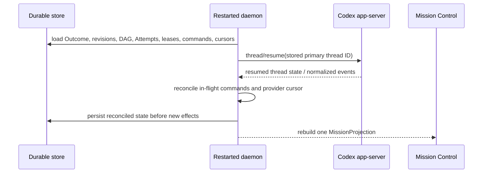

# Persistent mission runtime

- Status: canonical target architecture
- Decision date: 2026-09-15
- Baseline: `outcome-loop` at `f69c3387b13b00a1395c7acf7bd468163e6ae023`
- Scope: Codex-first Outcome planning, supervision, execution, recovery, and owner experience

This is the canonical architecture for new Outcome execution. It supersedes one-shot, session-first, hidden-transcript, and model-as-scheduler designs. [Runtime status](../STATUS.md) distinguishes accepted target behavior from code that exists today. [The execution map](../roadmap/persistent-session-execution-map.md) is the only active implementation order.

## Product architecture



The UI is one timeline. Its internal conversations have distinct authority:

- The Contract conversation clarifies intent and freezes a Contract artifact.
- A fresh planning conversation receives that artifact and proposes a Plan and WorkUnit DAG. The service and UI exist; the literal installed `/mission` command is still an implementation exit, not current behavior.
- The owner approves a specific Plan revision before execution is released.
- The Mission Supervisor provides mission-level intelligence during execution.
- WorkUnit threads execute bounded work.
- The daemon is the deterministic authority, state, scheduler, custody, check, and projection layer.

Codex proposes and executes. The daemon authorizes, schedules, records, checks, and projects. The owner controls scope, material authority, external effects, replacement, and final Accept.

## Runtime topology



The Supervisor and daemon are deliberately coupled through a typed protocol, not shared memory or hidden control:

1. the daemon publishes versioned mission events and bounded context;
2. the Supervisor interprets them and emits typed recommendations or commands;
3. the daemon validates every command against current revision, scope, authority, custody, and idempotency rules;
4. only the daemon mutates durable mission state or releases work.

The default automatic set is only context delivery and reversible guidance. Every automatic command must be on a daemon-owned allowlist and bind the exact Plan revision, WorkUnit, approved profile, Attempt/session generation, budget bound, and idempotency key. It may use only approved facts, must stay inside unchanged scope, acceptance criteria, and approach, and may cause no external effect. Anything else remains a recommendation for owner or Plan review. It cannot change Contract or Plan scope, dependencies, permissions, external effects, replacement, or Result Accept.

## Session and thread cardinality



For vNext, one Attempt equals one exclusive worktree lease, one Kennel Session, and one persistent primary Codex app-server thread with many turns. A Codex-native child agent is provider-internal activity under that Attempt. It is not a WorkUnit, scheduler, or independent authority.

A material Plan revision gets a fresh Supervisor thread seeded from canonical records. Small steering inside unchanged WorkUnit scope stays in the same Attempt and thread. Replacement is exceptional: explicit owner choice, material scope/authority change, or proven irrecoverability.

## Context and artifact lifecycle



Before a session starts, the daemon compiles and hashes an input manifest containing the exact Contract and Plan revisions, WorkUnit goal and criteria, approved project snapshot, relevant facts and artifacts, applicable owner decisions, profile/worktree/effect limits, checks, and expected evidence. Codex receives a readable packet; the manifest remains canonical.

A worker publishes an output manifest: base and result revisions, changed files, API/schema/type changes, decisions, checks, retained artifacts, risks, and a concise handoff. Downstream workers receive the exact approved output version named by a Plan edge. They never inherit another worker's private transcript, hidden reasoning, scratch environment, or uncommitted worktree state.

Every context delivery records source, version, target, reason, content hash, and acknowledged or delivery-unknown state. Large repository context stays in the assigned worktree for native inspection. Packets select mission-specific context rather than copying the repository or repeatedly injecting the whole mission.

## Command and authority flow



Thin plugins, skills, and hooks may provide ingress, sensors, rendering, or provider adaptation. They may not become a scheduler, database, authority source, or second session engine. Native development commands are allowed inside the exclusive worktree. Network, deploy, merge, publish, payment, messaging, or other external effects require separately recorded authority.

## Attention, steering, stop, and replacement

- A finished turn is not WorkUnit completion.
- `needs_you` is nonterminal. The Attempt, worktree lease, Session, and Codex thread remain the same.
- An authenticated answer targets the exact question generation. A recorded answer is not considered delivered until acknowledgement or reconciliation proves it.
- Steering while a turn is active uses native steering when supported; steering while idle begins the next turn.
- Interrupt stops the current turn only.
- Cancel ends an Attempt only after an acknowledged or proven stop. An ambiguous provider effect retains custody and enters reconciliation; it is never blindly replayed.
- Time alone does not prove death. Atomic replacement requires explicit selection or proven irrecoverability.

## Completion, checks, and Accept

```mermaid
sequenceDiagram
    participant W as Worker thread
    participant D as Daemon
    participant MS as Mission Supervisor
    actor U as Owner
    W->>D: ready_for_verification + output manifest
    D->>D: settle active turn and tracked children
    D->>D: fence writes; create immutable WorkUnit snapshot
    D->>D: run approved checks against that snapshot
    alt checks fail and Plan preauthorizes this rework class
        D->>MS: failed-check evidence for recommendation
        MS-->>D: optional bounded recommendation
        D->>W: same-thread rework; create new output version
        D->>D: stale every consuming descendant
    else checks fail and rework is not preauthorized
        D->>U: owner decision or Plan review required
    else checks pass
        D->>D: attest WorkUnit snapshot and release ready dependents
        D->>MS: verified output + snapshot lineage event
    end
    D->>D: integration WorkUnit creates distinct integrated snapshot
    D->>D: final checks attest integrated snapshot and input lineage
    D->>U: Result + evidence + exact reviewed snapshot + one true next action
    U->>D: Accept / request rework / revise Plan
```

The Supervisor interprets evidence and recommends action. Deterministic checks decide their own pass/fail. The owner alone Accepts the Result.

## Restart and recovery



Durable state includes Outcome, Contract and Plan revisions, graph, approval, WorkUnit and Attempt state, Session and provider thread IDs, worktree lease/fence, command/question generation, provider event cursor, context and artifact hashes, check evidence, Result, and lineage. The app-server process may restart. The primary thread resumes by stored ID. Delivery-unknown commands reconcile before any retry. Kennel stores structured events and allowlisted evidence, not hidden model reasoning.

## Mission intelligence lifecycle

The Supervisor is persistent for the active Plan revision and event-driven. It wakes for completion claims, `needs_you`, failed checks, stalls or ambiguous state, artifact publication, drift, and owner steering. A compact periodic summary is triggered only by a daemon-owned durable cadence event while work is active. The Supervisor never self-schedules, polls, or creates timers.

It can:

- maintain a mission-level interpretation from canonical events;
- prepare bounded context packets and low-risk in-scope steering;
- summarize attention requests without erasing source provenance;
- diagnose failed checks and recommend same-thread rework;
- identify drift and propose an explicit Plan revision.

It cannot silently rewrite the graph or treat a recommendation as durable truth. Replanning is a new planning episode or Plan revision proposal. Existing verified artifacts retain lineage; new or materially changed WorkUnits wait for owner approval.

## Serial proof, then safe concurrency

The graph and worktree design support concurrency, but the first packaged proof releases one WorkUnit at a time. After custody, restart, context handoff, attention, and verification pass end to end, independent ready WorkUnits may run concurrently in separate worktrees. Integration is an explicit WorkUnit or reviewed merge step. No uncommitted filesystem state crosses workers.

## Budget policy

Budgets are targets, warnings, and Supervisor recommendation inputs. Kennel may recommend narrowing, steering, or replanning. There is no arbitrary aggressive default stop and no silent unlimited mode. A hard stop exists only for an explicit owner cap or a separately reviewed emergency policy, and it follows acknowledged-stop/reconciliation semantics.

## Compatibility boundary

This architecture applies only to new vNext execution records after cutover. Historical one-shot Attempts remain readable under their recorded execution model. They are never resumed into a persistent thread, rewritten, or dual-written. See [compatibility and migration](compatibility-and-migration.md).

## Rendered review companions

GitHub renders every Mermaid block above. Repository-authored SVG companions for offline and independent visual review are indexed at [architecture review diagrams](../assets/review/README.md). They are review views of this document, not a second architecture source.

## Immutable verification snapshot

`ready_for_verification` first closes worker write custody. The controller interrupts or settles the active turn, proves all tracked child commands have exited, and fences the worktree against further worker writes. Only then does the daemon create a content-addressed verification snapshot containing the exact tree, base revision, output-manifest hash, dependency artifact versions, approved check set, and profile. Checks run against that immutable snapshot, not the worker's mutable checkout.

Each check result, WorkUnit verification, published WorkUnit output, and its evidence name the exact WorkUnit snapshot digest they attest. Each WorkUnit has its own snapshot digest. The integrated Result has a distinct integrated snapshot digest plus the ordered input-lineage digests; final checks, its published change list, and owner review name that integrated snapshot. If any input changes, verification is stale and cannot be reused. Rework reopens custody in the same Attempt where permitted, produces a new output version and snapshot, and invalidates the affected verification lineage. A file change during checks either cannot reach the snapshot or fails the fence; it can never be published under an earlier pass.

## Serial artifact application and integrated result

For the first serial proof, every WorkUnit input names a source commit and complete source tree digest. WorkUnit A starts from the approved project snapshot. Each dependent WorkUnit starts from the verified predecessor result tree, not from an independent checkout plus a partial patch. A complete content-addressed change set is retained for audit and recovery, but the verified tree is the execution input.

A dependency fan-in is an explicit integration WorkUnit. It applies complete verified change sets in declared edge order onto a named base. A conflict stops integration and creates attention or a Plan-revision proposal; Kennel never guesses a merge. The integration WorkUnit publishes the single integrated-result tree. Final checks and owner review run against that distinct integrated snapshot and retain the exact ordered WorkUnit input lineage. No separately passing unit can substitute for an assembled result that has not passed its own checks.

When an upstream verified output is replaced, the daemon walks artifact-consumption edges and marks every consuming input, descendant verification, integration result, and applicable final check stale. Stale descendants cannot release work or appear as verified. They must rebase/reapply and verify against the new version, or remain historical under the older lineage.

## Native coding profile

The first Codex substrate proof uses a named `codex_native_worktree_v1` profile: repository inspection, admitted file edits, shell development commands, failing-test observation, repair, rerun, owner steering, and continued work in one persistent thread. It inherits only reviewed Kennel mission skill/configuration plus explicitly approved project instructions; provenance and hashes are recorded.

Filesystem writes are confined to the leased worktree and declared temporary/cache locations. Repository-local development commands are allowed by the profile. Network-dependent package installs, downloads, remote tests, or service calls are denied unless the approved profile names their hosts and effect class; they are recorded separately from ordinary local checks. Deploy, publish, merge, message, payment, and other external effects always require distinct authority.

## Intake and mission entry

Contract intake supports multiple clarification questions in one request and repeated follow-up rounds until the owner freezes a Contract revision. Target behavior: starting the installed `/mission` command automatically opens a fresh planning thread and sends the first planning turn with the frozen Contract and project context. The installed mission skill/command is a tested runtime artifact, not documentation: Kennel verifies its digest, provider visibility, command registration, and capability handshake before it offers mission start.

Planning shows explicit pending, delivered, approval-required, approved, and error states. Provider output is schema-validated and source-attributed consistently; an empty composer, one-question cap, missing command, or unverified provider response blocks the gate rather than degrading silently.

## Rework and Supervisor failure semantics

A failed approved check permits automatic same-thread rework only when the current Plan explicitly grants that rework class, the coding profile and authority do not widen, no external effect is added, the rework budget remains, and the exact failed evidence is attached. Otherwise the Supervisor may recommend rework but the owner or a Plan revision must authorize it.

Owner-requested change after Result assembly creates a new rework revision. The daemon identifies affected WorkUnits and descendants from artifact lineage, marks the assembled Result superseded, preserves the old evidence, and executes only an approved revised graph. Acceptance never migrates to the new Result.

The Mission Supervisor is optional for safety and liveness. If it crashes, reaches context limits, times out, or emits an invalid recommendation, the daemon records the fault, rejects unusable commands, and continues deterministic scheduling, command delivery, checks, projection, and recovery. Healthy workers may finish. The owner may still answer, steer, stop, inspect evidence, request rework, and Accept. Supervisor recovery starts from canonical events and summaries, never hidden transcript state.

## Harness connection

Installation, plugin/skill pairing, reconnect, propose-versus-authorize rules, and version drift are specified in [Harness connection and authority](harness-connection-and-authority.md). A thin adapter is not trusted because it is installed; it must negotiate capabilities and authenticate to the daemon. Desktop reconnection attaches to durable mission state without restarting a healthy daemon.
