# Persistent-session execution map

- Status: only active dependency-ordered implementation map
- Architecture: [persistent mission runtime](../architecture/persistent-mission-runtime.md)
- Rule: architecture and documentation freeze first; no production cutover before independent review

```mermaid
flowchart LR
 A[0 Architecture freeze] --> B[1 Native Codex substrate proof]
 B --> C[2 Unified session controller]
 C --> D[3 S1 interactive extension]
 D --> E[4 Persistent-session cutover]
 E --> F[5 Context and Artifact Protocol]
 F --> G[6 Nonterminal attention]
 G --> H[7 Mission Supervisor protocol]
 H --> I[8 MissionProjection]
 I --> J[9 UI integration]
 J --> K[10 Serial packaged proof]
 K --> L[11 Cleanup and expansion]
```

## 0. Architecture freeze

Land the canonical runtime, compatibility policy, authority map, audit manifest, and this map. Independently review diagrams, terminology, historical compatibility, and implementation seams. Freeze event/command names and cardinality invariants before code work.

Exit: no canonical document or repository-owned steering asset contradicts the accepted ontology.

## 1. Native Codex substrate proof

Prove `thread/start`, multiple `turn/start`, active-turn steering where supported, `turn/interrupt`, and fresh-process resume of the same thread. Record normalized events and provider/client IDs.

Exit: a repeatable test demonstrates persistence without an Outcome cutover.

## 2. Unified session controller

Extend/reuse the Chat controller as sole writer for governed sessions. Add command generations, idempotency, event-cursor recovery, and acknowledged, rejected, and delivery-unknown states. Do not build a second session engine.

Exit: concurrent callers, daemon restart, duplicate commands, and ambiguous delivery converge without duplicate effects.

## 3. S1 interactive extension

Start from the source-accepted S1 implementation; its packaged macOS/runtime proof remains open. Carry authenticated owner identity through answer, steer, interrupt, cancel, and replace envelopes. Keep legacy routes as compatibility ingress until callers migrate.

Exit: source tests and packaged macOS/runtime evidence prove no stale or cross-Attempt command lands.

## 4. Persistent-session cutover

Add `persistent_codex_v1`. Admit one Codex WorkUnit Attempt into one exclusive worktree, one Kennel Session, and one persistent thread. Legacy one-shot rows remain read-only history.

Exit: start, several turns, restart/resume, and clean completion claim work in one Attempt.

## 5. Context and Artifact Protocol

Implement durable, typed, versioned input and output manifests. Input manifests bind exact Contract, Plan, WorkUnit, project snapshot, profile/session generation, allowed facts, owner decisions, checks, effect limits, and named dependency artifacts. Select and redact context, preserve provenance, hash the canonical manifest, and record delivery acknowledgement or delivery unknown before retry.

Output manifests bind base/result revisions, changed files, API/schema decisions, checks, retained artifacts, risks, and handoff. A daemon verification pass freezes a content-addressed output. Every Plan edge names the exact frozen artifact/revision/decision passed downstream. No transcript, hidden reasoning, uncommitted worktree state, or mutable “latest” summary crosses an edge.

Exit: restart, duplicate delivery, tamper, redaction, size-bound, stale-edge, and delivery-unknown tests converge on one exact downstream packet; failed checks cannot publish a verified output.

## 6. Nonterminal attention

Implement `needs_you` as a nonterminal question generation with retained custody. Answer and resume the same thread. Repair cancel and explicit hard-stop paths so ambiguous effects reconcile instead of replaying provider Kill.

Exit: repeated restart at every boundary neither loses an answer nor duplicates a stop.

## 7. Mission Supervisor protocol

Create one Supervisor thread per active Plan revision. Define typed daemon-to-Supervisor events and Supervisor-to-daemon recommendations/commands. The default automatic set is only context delivery and reversible guidance. Every automatic command must be on an explicit allowlist and bind the exact Plan, WorkUnit, approved profile, Attempt/session generation, budget bound, and idempotency key. It must use approved facts, stay inside unchanged scope/acceptance criteria/approach, and cause no external effect. Anything else is a recommendation for owner or Plan review.

Periodic summary is triggered only by a daemon-owned durable cadence event. The Supervisor never self-schedules, polls, or creates timers.

Exit: capability tests prove the Supervisor can perform only the allowlisted in-scope actions and cannot change graph, scope, criteria, approach, authority, effects, replacement, or Accept.

## 8. MissionProjection

Build one durable projection from canonical state: Outcome, revisions, DAG, WorkUnits/current Attempts, attention, Supervisor summary/recommendations, checks, evidence, Result, and one true next action. Include truthful legacy badges.

Exit: projection rebuild after restart is stable and does not depend on live transcripts.

## 9. UI integration

Use the existing Work shell. Present one continuous timeline with internal Contract, planning, Supervisor, and worker boundaries; graph above WorkUnit/current-Attempt Kanban; session detail on drill-down; raw provider transcript below that.

Exit: desktop and plugin paths show the same projection and authority; keyboard, empty, loading, stale, error, and attention states pass review.

## 10. Serial packaged proof

Run a real three-WorkUnit Codex Outcome serially. Prove manifests, exact artifact handoff, bounded automatic guidance, `needs_you`, steering, daemon/app-server restart, failed-check same-thread rework, verified Result, and owner Accept. Package install, launch, and rollback evidence.

Exit: clean-machine dogfood and independent review pass.

## 11. Cleanup and expansion

Only after the packaged proof: remove one-shot production paths historical readers do not need; delete compatibility ingress after observed migration; enable independent-worktree concurrency; expand controlled child-agent observation; consider other providers from proven protocol needs; tune budget advice from measurements.

## Explicit deferrals

No provider-neutral persistent-session abstraction, swarm scheduler, global forever Supervisor, transcript sharing, speculative context lake, aggressive default token stop, or wholesale UI rewrite belongs before the serial proof.
