# Persistent-session execution map

- Status: proposed reconciled dependency-ordered implementation map
- Architecture: [persistent mission runtime](../architecture/persistent-mission-runtime.md)
- Connection contract: [harness connection and authority](../architecture/harness-connection-and-authority.md)
- Rule: architecture and documentation freeze first; no production cutover before independent review
- Current promoted head: `2c469cb11681da14a1abfb62f6171b2b7c4b5d44`

## Current accounting (2026-09-17)

Stages 0-3 are promoted complete: Contract freeze (`f31cdca4`), native Codex substrate (`643e955c`), compatibility/unified controller including S2.4 crash matrix (`6bf0e39c`), and durable owner-command authority (`2c469cb1`). The production listener composition is candidate `18a77408`, not promoted.

Stages 4-9 are partial. Their open exits are respectively: public pairing/revocation projection and packaged connection proof; multi-question intake; installed/provider-verified `/mission` command and automatic first turn; typed Needs-You transaction plus serial three-unit proof; complete immutable manifests/integrated tree proof; and canonical MissionProjection/typed next action/freshness/Result helpers. Stages 10-12 are not started. Planning service/UI exist today; references below to installed or automatic `/mission` describe an exit criterion, not current behavior.

P0 product/backend seams are the typed Needs-You Q&A transaction, public renderer-safe harness authority API, and server-owned WorkUnit MissionProjection.

```mermaid
flowchart LR
 A[0 Contract freeze] --> B[1 Native Codex + compatibility proof]
 B --> C[2 Unified session controller]
 C --> D[3 S1 + authenticated harness connection]
 D --> E[4 Intake + installed mission entry]
 E --> F[5 Persistent-session cutover]
 F --> G[6 Artifact, integration + immutable verification]
 G --> H[7 Nonterminal attention]
 H --> I[8 Supervisor + failure isolation]
 I --> J[9 MissionProjection]
 J --> K[10 UI integration]
 K --> L[11 Serial packaged proof]
 L --> M[12 Cleanup and expansion]
```

## 0. Contract freeze

Land the canonical runtime, compatibility policy, connection/authority contract, exact artifact-application rule, immutable verification rule, rework/staleness transitions, audit manifest, diagrams, repository guidance, and this map. Freeze command/event/state names, capability classes, coding profile, and cardinality invariants.

Exit: independent review maps every stated falsifier to an enforceable invariant and no canonical document or steering asset contradicts it.

## 1. Native Codex and compatibility proof

Prove one real `codex_native_worktree_v1` loop in one persistent thread: inspect files, edit, run a failing test, repair, rerun successfully, receive owner steering, and continue. Also prove thread start, many turns, active steer, typed request/answer, interrupt, fresh-process resume, exact cwd/worktree, command/event/client/turn IDs, and restart behavior. Record inherited configuration/mission-skill provenance; prove filesystem confinement and explicit treatment of network-dependent commands.

Resolve binary path, version, hash, protocol/capability fingerprint, and cloud/server provenance where applicable. The evidence wrapper fails on skip. Run against pinned and latest supported Codex where available.

Exit: repeatable Linux deterministic evidence plus live packaged macOS evidence proves persistent native coding, not only chat or mocks; intended coding is admitted while undeclared filesystem/network/external effects fail closed.

## 2. Unified session controller

Extend/reuse the Chat controller as sole writer for governed sessions. Add command generations, idempotency, event-cursor recovery, child-command tracking, and acknowledged/rejected/delivery-unknown states. Do not build a second session engine.

Exit: concurrent callers, restart, duplicates, ambiguous delivery, and surviving child commands converge without duplicate effects or false quiescence.

## 3. S1 and authenticated harness connection

Extend S1 across answer, turn, steer, interrupt, cancel, replace, approval, and Accept. Implement discovery, signed/content-addressed adapter install or upgrade, one-time pairing, short-lived capability binding, capability check, token rotation, desktop-to-existing-daemon reconnect, and connected/degraded/action-needed states. Routine current-generation answers do not trigger native dialogs; material authority deltas do.

Exit: an unpaired/spoofed/stale adapter cannot authorize or widen an action; reconnect preserves one mission without daemon restart; native confirmations occur exactly for material transitions; version drift produces a truthful repair state.

## 4. Intake and installed mission entry

Implement multi-question Contract clarification and repeated follow-up rounds. Install/register the real mission skill/command, verify its digest and provider visibility, automatically send the first planning turn with the frozen Contract, schema-validate provider plans, and expose pending/delivered/approval-required/approved/error states.

Exit: packaged tests defeat the one-question limit, empty planning composer, docs-only command, missing provider verification, lost approval, and silent-error falsifiers.

## 5. Persistent-session cutover

Add `persistent_codex_v1`. Admit one Codex WorkUnit Attempt into one exclusive worktree, one Session, one persistent thread, and the negotiated pinned profile. Legacy one-shot rows remain read-only history.

Exit: start, many turns, restart/resume, reconnect, and clean completion claim work in one Attempt without changing the pinned harness/profile identity.

## 6. Artifact, integration, and immutable verification

Implement hashed input/output manifests. In the serial path, A starts from the approved source tree and every dependent starts from its verified predecessor result tree. Retain complete change sets for audit. Fan-in uses an explicit integration WorkUnit; conflicts stop for attention or Plan revision. Final checks and review bind the single frozen integrated-result tree.

On readiness, close active turns and child commands, fence writes, then make a content-addressed verification snapshot. Bind checks, evidence, publication, and owner review to it. Rework creates a new version and invalidates every consuming descendant through artifact edges.

Exit: restart, duplicate delivery, tamper, redaction, size, stale edge, conflict, moving-file, assembly, and delivery-unknown tests converge on one tree; A's API reaches B; separately passing units cannot publish an unchecked assembly.

## 7. Nonterminal attention

Implement `needs_you` as a retained-custody question generation. Answer and resume the same thread. Repair cancel/hard-stop paths so ambiguous effects reconcile rather than replaying Kill.

Exit: repeated restart at every boundary neither loses an answer nor duplicates a stop, and routine answer delivery does not demand material-authority confirmation.

## 8. Supervisor protocol and failure isolation

Create one Supervisor thread per active Plan revision with typed events and commands. Keep automatic action to allowlisted context delivery and reversible in-scope guidance. Failed-check auto-rework is allowed only when the approved Plan grants that class, authority/profile/effects are unchanged, budget remains, and exact evidence is attached.

Treat crash, context exhaustion, timeout, malformed output, or unavailable Supervisor as a degraded advisory component. The daemon and owner paths continue; recovery rebuilds from canonical events.

Exit: capability and fault-injection tests prove the Supervisor cannot change graph/scope/criteria/authority/effects/replacement/Accept, stale descendants cannot survive upstream rework, and healthy work/owner answer-stop-review remains usable without the Supervisor.

## 9. MissionProjection

Build one durable projection from canonical state, including connection/compatibility state, immutable snapshot and artifact lineage, stale descendants, Supervisor degradation, attention, checks, evidence, Result, and one true next action. Include truthful legacy badges.

Exit: restart rebuild is stable and does not depend on live transcripts.

## 10. UI integration

Use the existing Work shell. Present one timeline with internal conversation boundaries, graph above current Attempts, drill-down session detail, raw transcript below, and clear connection/pending/error/authority-delta states.

Exit: desktop and plugin show the same projection and authority; reconnect, keyboard, empty, loading, stale, degraded, error, attention, confirmation, and no-confirmation routine-answer states pass visual review.

## 11. Serial packaged proof

Run a clean-machine three-WorkUnit Codex Outcome serially. Prove install/discovery/pairing, compatibility state, multi-round intake, automatic first planning turn through the then-installed `/mission` command, Plan approval, native coding loop, exact predecessor-tree handoff, conflict behavior, immutable checks, bounded supervision, `needs_you`, steering, desktop/daemon/app-server restart and reconnect, failed-check rework with stale-descendant invalidation, Supervisor failure, checked integrated Result, owner Accept, adapter/harness upgrade and rollback.

Exit: complete dogfood evidence and independent review pass with no skip and every falsifier exercised.

## 12. Cleanup and expansion

Only after packaged proof: remove one-shot production paths historical readers do not need; remove compatibility ingress after observed migration; enable independent-worktree concurrency; expand controlled child-agent observation; add other providers one at a time through the same discovery/pairing/capability contract; tune budgets from measurements.

## Explicit deferrals

No provider-neutral persistent-session abstraction, swarm scheduler, global forever Supervisor, transcript sharing, speculative context lake, aggressive default token stop, silent auto-update across active missions, or wholesale UI rewrite belongs before serial proof.
