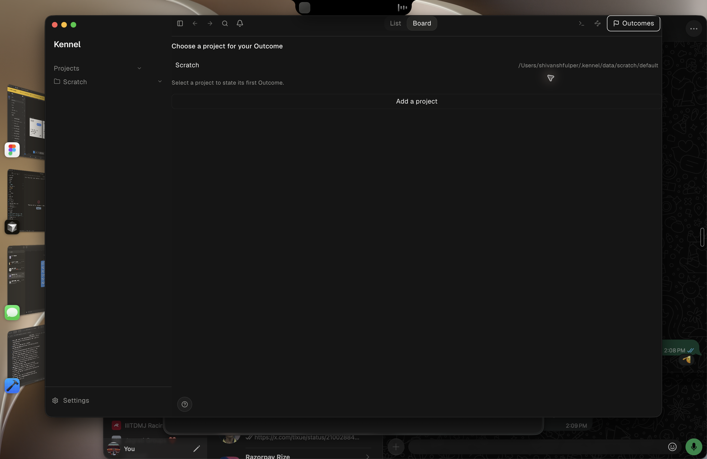
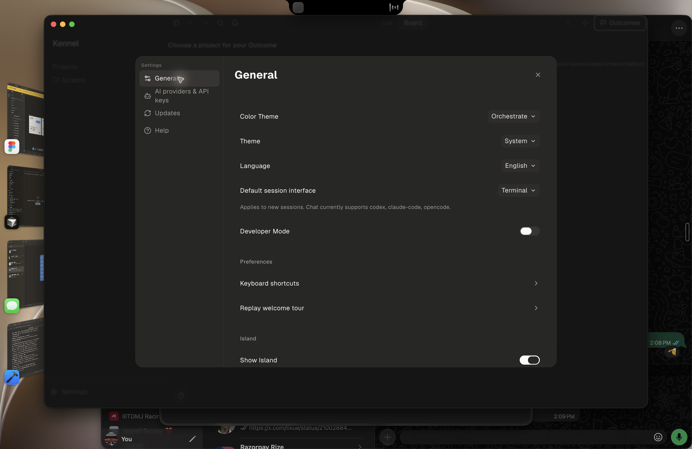
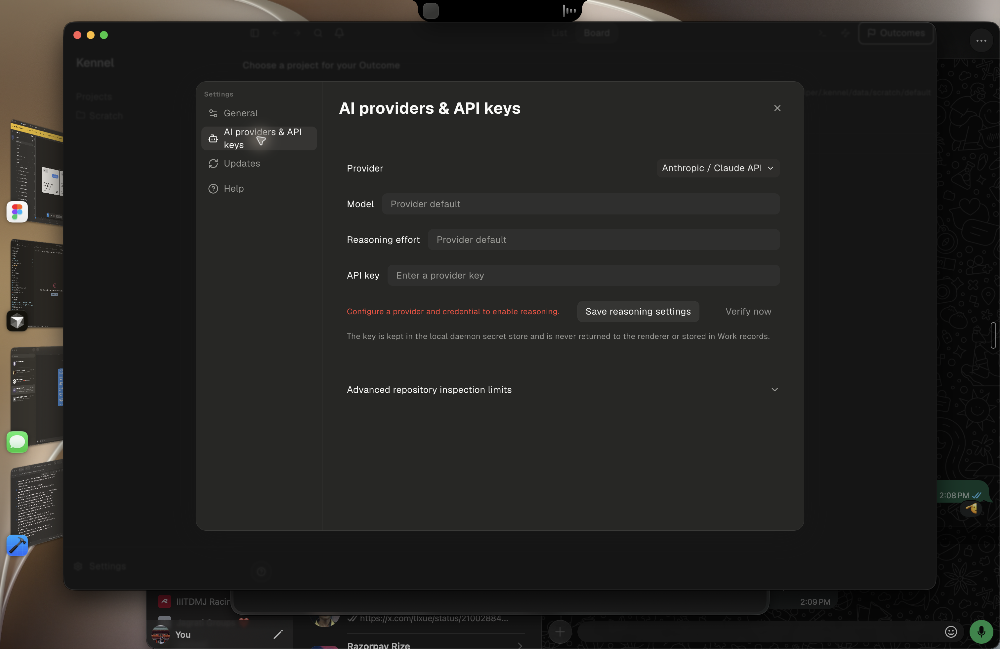

# Stage 3 live Mac journey — blocked report

## 1. Verdict and tested target

**BLOCKED / Stage 3 exit not proven.** Tested detached scratch clone at `6c11583bec922d323ae81037041a17523ca0811f` (`outcome-loop`). The packaged app built, passed identity verification, installed at `/Applications/Kennel.app`, launched, and its daemon reported the exact requested revision. Step 3 failed: no real owner-facing Codex adapter-install or pairing path was discoverable. Per the run rule, testing stopped there and no product code was changed.

## 2. Evidence boundaries

Evidence classes: `packaged-app`, `electron-real-daemon`, and `not-observed`. Computer Use captured screenshots and accessibility trees, summarized in [UI observations](evidence/stage-3-live-mac-journey/ui-observations.md). Existing `~/.kennel` state was present, so this was not a pristine first launch.

## 3. Environment and launch health

| Item | Value |
| --- | --- |
| macOS | 27.0 (26A428) |
| Architecture | arm64 |
| Go | go1.26.4 darwin/arm64 |
| Node / npm | v22.23.2 / 10.9.8 |
| Exact build command | `npm --prefix frontend run package` after documented `npm run bootstrap` |
| Package identity | `in.heywaldo.kennel`, Kennel 0.10.3, arm64 |
| Daemon | PID 76465, loopback 127.0.0.1:3031, `/Applications/Kennel.app/Contents/Resources/daemon/kennel-daemon` |

`/healthz` returned `status: ok`; `/readyz` returned `status: ready`; both reported build revision `6c11583bec922d323ae81037041a17523ca0811f`. The raw health response remains in the local audit artifact and is intentionally not published because it contains machine-specific metadata.

## 4. Blind first-time-user journey

The initial visible state honestly said “Kennel daemon is unavailable.” A subsequent refresh showed the existing Scratch Project, not a clean profile. Settings did not expose an adapter or pairing route. A first-time owner could not begin the requested Codex installation journey.

## 5. Experienced-operator journey

Not run. The Stage 3 journey was stopped at the missing adapter entry point.

## 6. Interrupted and recovery journey

Not run. No pairing/bearer existed, so restart/recovery would not establish the requested state survival.

## 7. Current versus intended experience

The requested path requires install -> owner pairing intent -> adapter challenge/prove -> bearer authentication -> negative proofs -> rotation/revocation -> restart/upgrade. The packaged UI only exposed general/provider settings and no connection lifecycle. The installed app's ready daemon is evidence of launch health, not evidence of adapter capability, pairing, Verification, or Acceptance.

## 8. Coverage summary

2 PASS, 4 PARTIAL, 1 FAIL, and 18 NOT_TESTED. Full matrix: [coverage.csv](evidence/stage-3-live-mac-journey/coverage.csv).

## 9. Prioritized findings

**P1 KUX-001 — Installed packaged app has no owner-facing Codex adapter install or pairing journey.** Steps and expected/actual behavior are recorded in [findings.json](evidence/stage-3-live-mac-journey/findings.json). This blocks all remaining mandatory journey stages.

## 10. Interaction, accessibility, responsive, and motion review

Mouse interaction opened Settings and provider settings. Accessibility exposed named controls. Keyboard, resizing, reduced-motion, and motion stress tests were not run because the required pairing journey was unavailable.

## 11. Truth and authority boundary review

The initial daemon-unavailable state was truthful, and the later health endpoints were daemon-backed. No owner pairing intent was opened and no secret, challenge, bearer, proof, rotate, revoke, or external effect was attempted.

## 12. Packaged-build review

PASS for package, identity, manual copy to `/Applications`, visible launch, and exact cleanup. First package attempt after only `npm --prefix frontend ci` failed because the documented bootstrap also installs `packages/kennel-island`; after `npm run bootstrap`, the requested package command passed. This was an environment/setup correction, not a source defect. Raw logs remain in the local audit artifact and are intentionally not published because they contain machine-specific metadata.

## 13. Automated-test evidence

Not run. The required full backend suite was intentionally not run after KUX-001 blocked the journey.

## 14. Recommended repair sequence

First implement a discoverable daemon-backed adapter install/pairing owner surface without exposing bearer material. Then rerun this complete journey from a fresh isolated profile, including wrong and replayed proofs, rotation, revocation, restart, upgrade, and the backend full suite. Detailed bounded handoff: [fix-handoff.md](evidence/stage-3-live-mac-journey/fix-handoff.md).

## 15. Limitations and untested areas

Not proven: real adapter installation; pairing intent; valid authentication; wrong-secret rejection; stale/replayed challenge rejection; rotation invalidating old bearer; revocation; pairing state after restart; state survival across upgrade; backend full suite; a pristine first launch; saved local UI screenshots.

## 16. Artifact index

- Packaged UI screenshots:

  

  

  

- [UI observations](evidence/stage-3-live-mac-journey/ui-observations.md)
- [Action log](evidence/stage-3-live-mac-journey/action-log.jsonl)
- [Coverage](evidence/stage-3-live-mac-journey/coverage.csv)
- [Findings](evidence/stage-3-live-mac-journey/findings.json)
- [Fix handoff](evidence/stage-3-live-mac-journey/fix-handoff.md)
